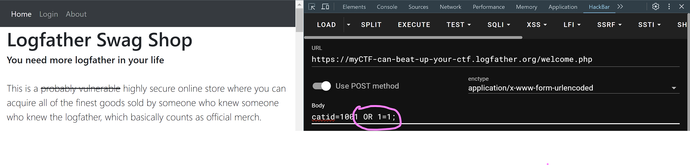

# SQL Injection - Part Deux
## How do I even?

Alright, all you cybernauts, fasten your seatbelts and put your keyboards in the upright position - we're about to take a deep dive into the notorious world of SQL injection. We're talking about the MariaDB backend, an HTTP post, URL encoding, a sprinkle of educated guessing, and the pièce de résistance: the UNION command.

Let's set the stage. You've got a web app - one of those relics from the early 2000s, coded by some caffeine-fueled developer who thought SQL injection was a medical condition. The app's got a MariaDB backend, and it's serving up data as eagerly as a golden retriever fetching a tennis ball.

For instance, you've got a URL like this: `http://example.com/products?catid=1000`. This harmless-looking URL is actually a goldmine for an attacker. It's passing the catid parameter directly into an SQL statement behind the scenes. Something like this:
```sql
SELECT * FROM Products WHERE catid = 1000;
```
Now, our intrepid hacker, armed with nothing but a keyboard and a solid understanding of SQL, decides to add a little something extra to that catid parameter, like `'` OR `'1'='1`. The resulting query?
```sql
SELECT * FROM Products WHERE catid = 1000 OR '1'='1';
```

If you're looking at the tool that we mentioned previously, which Of course you are, because you didn't just skim this document hunting for clues and now you're reading backwards from screenshots you don't recognize, then you would see something that looks like this. 



And boom! Just like that, we injected a statement that returns 'TRUE' from the database, silently and uselessly. But our hacker wants more. They want to see what other databases are hiding in the shadows. So, they might try injecting a command to list databases.  I'll save you the hassle of learning this database.

You can read all about how this works later, but in this case, we are pilfering the filthy database behind this amazing website and aligning with with the correct output of columns.  To do that, you need to figure out how many columns you have.   Do this, adding a new 'Null' until you stop getting errors.  You can also look at your displayed tables on teh website and take an educated guess.

```sql
catid=1000 UNION SELECT NULL, NULL--
```
When you have the right amount - which isn't displayed below, so stop copy and pasting, you'll be able to view all the tables by simply asking the database to tell you.  You can substitute `NULL` for numbers just to make keep track easier, but they'll be displayed with the data.  The life of a hacker is hard.  You could always just use your favourite spreadsheet tool and not somebody elses server, that's an option! 


```sql
UNION SELECT table_name, 2, 3, 4, 5, 6 FROM information_schema.tables--
```
This will look for the tables using a clever trick and add it to the output of your super hardcore SQL injected page.  Now, it's a guessing game to find more information.

Here's where the magic happens. The `UNION` command is the Swiss Army knife of SQL injection. It allows our hacker to combine the results of their injected query with the results of the original query. But there's a catch: the number of columns in the UNIONed query has to match the original.

If our original query was fetching three columns of data, our injection needs to request three columns too. Any more or less, and it'll spit out errors like a broken vending machine.

Want to see what exists in the `products` table?  Give 'er, young blood. 

```sql
UNION SELECT COLUMN_NAME,2,3,4,5 FROM INFORMATION_SCHEMA.COLUMNS WHERE TABLE_NAME = 'products' --
```

You have what you need.  The rest is on your cranial neurons bouncing around in the appropriate flightpaths.  Move your statements around, ask your favourite manager that's been replaced by AI, do the needful.  Score some points.

Remember, my friends, with great power comes great responsibility. SQL injections are a potent tool in the wrong hands. As cyber warriors, it's our job to defend against such threats. So, keep your wits about you, sanitize your inputs, and keep your apps secure. The future of the digital realm depends on it.